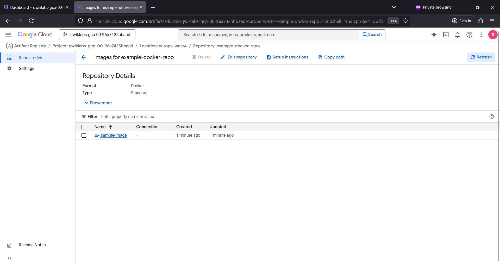

# artifareg
artifareg :  Artifact Registry # Package Manager

## Objective

- Create a private Docker repository in Artifact Registry
- Set up authentication
- Push/Pull image to/from the repository

# Artifact Registry

